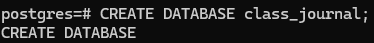
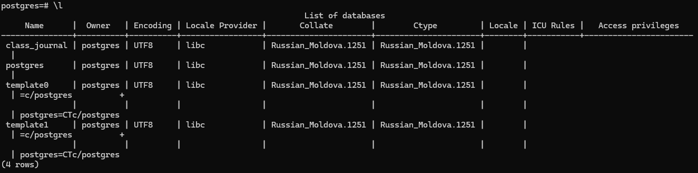
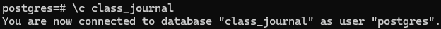
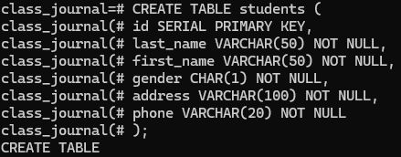
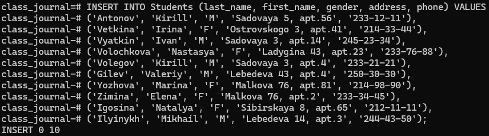
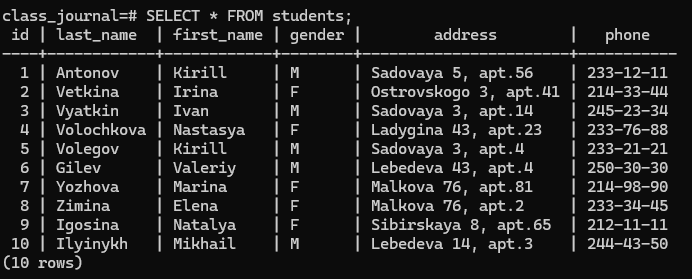
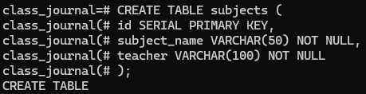
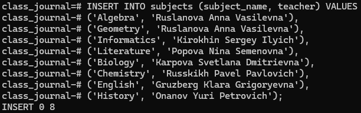
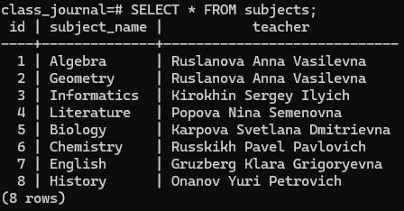

# 📌 PostgreSQL: Создание базы данных и таблиц

## 🚀 Этап 1: Создание базы данных
Сначала создаём базу данных `class_journal`:

```sql
CREATE DATABASE class_journal;
```



Теперь проверяем, что база данных появилась в списке:
```sql
\l
```



Подключаемся к базе данных:
```sql
\c class_journal
```



## 📋 Этап 2: Создание таблицы "Ученики"
Создаём таблицу students:
```sql
CREATE TABLE students (
    id SERIAL PRIMARY KEY,
    last_name VARCHAR(50) NOT NULL,
    first_name VARCHAR(50) NOT NULL,
    gender CHAR(1) NOT NULL,
    address VARCHAR(100) NOT NULL,
    phone VARCHAR(20) NOT NULL
);
```



Теперь добавляем данные:
```sql
INSERT INTO Students (last_name, first_name, gender, address, phone) VALUES
('Antonov', 'Kirill', 'M', 'Sadovaya 5, apt.56', '233-12-11'),
('Vetkina', 'Irina', 'F', 'Ostrovskogo 3, apt.41', '214-33-44'),
('Vyatkin', 'Ivan', 'M', 'Sadovaya 3, apt.14', '245-23-34'),
('Volochkova', 'Nastasya', 'F', 'Ladygina 43, apt.23', '233-76-88'),
('Volegov', 'Kirill', 'M', 'Sadovaya 3, apt.4', '233-21-21'),
('Gilev', 'Valeriy', 'M', 'Lebedeva 43, apt.4', '250-30-30'),
('Yozhova', 'Marina', 'F', 'Malkova 76, apt.81', '214-98-90'),
('Zimina', 'Elena', 'F', 'Malkova 76, apt.2', '233-34-45'),
('Igosina', 'Natalya', 'F', 'Sibirskaya 8, apt.65', '212-11-11'),
('Ilyinykh', 'Mikhail', 'M', 'Lebedeva 14, apt.3', '244-43-50');
```



Проверяем содержимое:
```sql
SELECT * FROM Students;
```



## 📚 Этап 3: Создание таблицы "Предметы"
Создаём таблицу subjects:
```sql
CREATE TABLE Subjects (
    id SERIAL PRIMARY KEY,
    subject_name VARCHAR(50) NOT NULL,
    teacher VARCHAR(100) NOT NULL
);
```



Добавляем данные:
```sql
INSERT INTO Subjects (subject_name, teacher) VALUES
('Algebra', 'Ruslanova Anna Vasilevna'),
('Geometry', 'Ruslanova Anna Vasilevna'),
('Informatics', 'Kirokhin Sergey Ilyich'),
('Literature', 'Popova Nina Semenovna'),
('Biology', 'Karpova Svetlana Dmitrievna'),
('Chemistry', 'Russkikh Pavel Pavlovich'),
('English', 'Gruzberg Klara Grigoryevna'),
('History', 'Onanov Yuri Petrovich');
```



Проверяем содержимое:
```sql
SELECT * FROM Subjects;
```

## 🔗 Заключение
Мы создали базу данных class_journal, две таблицы и заполнили их данными. Теперь можно использовать их для запросов, анализа или дальнейшей доработки.
